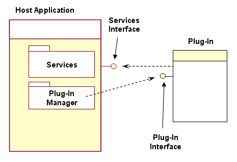
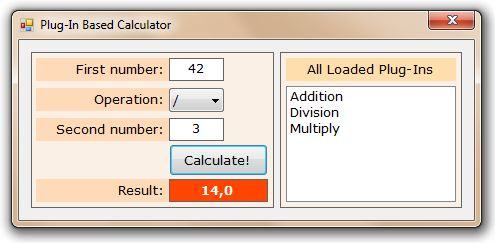
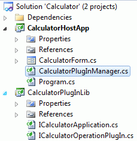
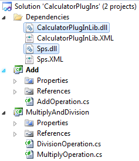

# A Simple Plug-In Library For .NET

> **This document was originally [published on Codeproject](https://www.codeproject.com/Articles/182970/A-Simple-Plug-In-Library-For-NET) as an article in the year 2011.**

In this article, I will introduce **plug-in based development** and explain a simple library named **SPS** (**S**imple **P**lug-In **S**ystem) that is used to develop **plug-in based applications and services** in .NET.

## Table of Contents

- Introduction
- What is Plug-In based application development?
- What is SPS?
- A sample calculator application with SPS
  - Using the application
  - Defining the plug-in interface
  - Defining the application interface
  - Building the application
  - Building plugins for the calculator
- Implementation of SPS
- Runnable applications/services
- References

## Introduction

A few month ago, when I was developing a **windows service** that performs some background operations, I needed to **extend** the service to add some **customer specific** codes. It was not proper to **mix** customer specific codes with my **core application** since these codes/classes can be removed later or I can add some codes for another customer too. So, my core application has to be **independent** from customer codes but must provide some common substructure for them. I decided to build my application as **plug-in based**. So, my customer specific codes are implemented as **independent plugins**.

I developed a **S**imple **P**lug-In **S**ystem for this purpose, then I used it in my other projects too. In this article, I will share my simple and flexible work and will explain how I implemented it.

## What is Plug-In based application development?

In computing, a **plug-in** is a set of software components that adds specific abilities to a larger software application [1]. You can allow to **extend** your application **without changing or even re-compiling** it by designing it as **plug-in based**. You can see a basic structure of an application - plugin relation in the figure below.



*Figure - 1: Basic architecture of a plug-in based application (from Wikipedia) [2].*

Since **host application** is independent from all **plug-ins** and can not know how they are **implemented**, it defines a **plug-in interface** that **must be implemented** by all plug-ins. Typically, a **plug-in manager** in the host application used to **load** and **manage** all plug-ins. In the simple case, all plug-ins are placed in a specific **plugin directory**, plug-in manager loads all **assemblies** (generally **dll** projects) in the plug-in directory and searchs for **classes those implement the plug-in interface**.

Plug-in manager may **load** plug-ins for **once** on statup of the host application in most simple case. Another approach may be to **load/unload** plug-ins **dynamically** while application is running. Even more, an application can **update plug-ins** while running. Thus, a plug-in can be updated without **restart** the main application. Host application can **use plug-ins** over plug-in interface after loading plug-ins.

In many application, a plug-in may also need to use some **functionalities of the host application**. So, the application may provide an interface to plug-ins that can be named as service interface or **application interface**. Thus, a plug-in can **call a method of the host application** when needed.

Another concept that is considered while developing plug-in based applications is **Application Domains**. Application domains provide an **isolation boundary** for security, reliability, versioning and for **unloading assemblies** [3]. A .NET process has single application domain by default. You can create other application domains in runtime.

An assembly **can not be unloaded** until the application domain (that hosts it) unloaded. So, if you loaded a plug-in assembly in your default application domain, it can not unloaded (thus, assembly file can not changed in file system) **until your application is closed**. If you create a **separated application domain** and load plug-ins into this domain, then you can safely unload/reload/change the assembly without restarting your main application. But, unfortunately, you can not directly use objects in other application domains and must use .NET remoting, marshalling and serializing techniques. If you don't really need to unload/update your plugins on runtime, you don't have to use application domains (In most scenarios, it is not needed). SPS also **does not use** application domains.

## What is SPS?

SPS is a simple and open source library that implements exactly the model in the ***figure 1\*** to provide an infrastructure for building plug-in based applications in .NET.

## A simple calculator application with SPS

We will develop a very **simple calculator application** to demonstrate the usage of SPS library.

### Using the application

First, let me show how the calculator works:



*Figure - 2: A plug-in based calculator application.*

**Calculator** application has a simple **GUI**. You simply enter **two number**, select **operation** and press the **Calculate** button. Also, you see all **loaded plug-ins** on the right side of the form.

Calculator application does not provide any operation itself. **Operations can be added as plug-ins** without changing the calculator application. In the figure 2, three plug-ins used to perform three operations (Addition, Division and Multiply). Operation combobox is filled **dynamically** according to currently loaded plug-ins. Plug-ins are placed in **PlugIns** folder in root application folder.

There are two projects in calculator solution:



*Figure - 3: Calculator application solution.*

**CalculatorHostApp** is the main application that provides the GUI. **CalculatorPlugInLib** contains **plug-in interface** and **application interface**. Both of projects add SPS.dll (Simple Plug-In System) to references to be able to use plug-in system.

### Defining the plug-in interface

We need a sign/char to show operation to the user (in operation combobox) and a method to calculate result for this operation:

```csharp
using Hik.Sps;
namespace CalculatorPlugInLib
{
    /// <summary>
    /// Defines the plug-in interface for the calculator application.
    /// A class must implement this interface to be a plug-in for the calculator.
    /// Calculator application uses plug-ins through this interface.
    /// </summary>
    public interface ICalculatorOperationPlugIn : IPlugIn
    {
        /// <summary>
        /// Gets the sign that represents this operation.
        /// For adding, it may be a plus sign (+).
        /// </summary>
        string OperationSign { get; }

        /// <summary>
        /// Performs the operation.
        /// </summary>
        /// <param name="number1">First number</param>
        /// <param name="number2">Second number</param>
        /// <returns>Result of operation according to this operation</returns>
        double DoOperation(double number1, double number2);
    }
}
```

This interface is used by calculator application and implemented by all plug-ins.

### Defining the application interface

Maybe it is not needed an **application interface** in a calculator application but I will define to demonstrate the usage of application interfaces. In SPS, you **must provide** an application interface even it has no member (an empty interface). Our application **provides** only **one method** to plug-ins:

```csharp
using Hik.Sps;

namespace CalculatorPlugInLib
{
    /// <summary>
    /// Defines the application interface that can be used by plug-ins.
    /// </summary>
    public interface ICalculatorApplication : IPlugInBasedApplication
    {
        /// <summary>
        /// This method can be called by plugins to show a message to the user if needed.
        /// </summary>
        /// <param name="message">The message to be shown</param>
        void ShowMessage(string message);
    }
}
```

### Building the application

We must implement the **ICalculatorApplication** interface in the calculator application:

```csharp
using System.Windows.Forms;
using CalculatorPlugInLib;
using Hik.Sps;

namespace CalculatorHostApp
{
    /// <summary>
    /// Implements ICalculatorApplication and provides a container/manager for plug-ins
    /// </summary>
    [PlugInApplication("Calculator")]
    internal class CalculatorPlugInManager : PlugInBasedApplication<ICalculatorOperationPlugIn>, ICalculatorApplication
    {
        /// <summary>
        /// This method can be called by plugins to show a message to the user if needed.
        /// </summary>
        /// <param name="message">The message to be shown</param>
        public void ShowMessage(string message)
        {
            MessageBox.Show(message);
        }
    }
}
```

**CalculatorPlugInManager** is the main class that is used to **load** and **manage** plug-ins. It implements **ICalculatorApplication** to be used by plug-ins. It also defines **PlugInApplication** attribute that is used by SPS to get name of the application (not a must but recommended).

It is inherited from **PlugInBasedApplication<ICalculatorOperationPlugIn>**. This is the key point of the class. **PlugInBasedApplication** provides **methods/properties** to **load** and **access** to plug-ins. It is a **generic** class that takes **plug-in interface** type as generic parameter.

Let's see how **CalculatorPlugInManager** is used in calculator application. First, we define an object from **CalculatorPlugInManager**:

```csharp
/// <summary>
/// The plug-in manager objects to communicate with plug-ins.
/// </summary>
private CalculatorPlugInManager _plugInManager;
```

Then we **load plugins** and fill **combobox** and **listbox** in the form's **constructor**:

```csharp
//Create plug-in manager and set plug-in directory
_plugInManager = new CalculatorPlugInManager();
_plugInManager.PlugInFolder = Path.Combine(GetCurrentDirectory(), "PlugIns");

//Load all plugins
_plugInManager.LoadPlugIns();

//Fill combobox and listbox by plugins
foreach (var plugIn in _plugInManager.PlugIns)
{
    cmbOperation.Items.Add(plugIn.PlugInProxy.OperationSign);
    lstPlugIns.Items.Add(plugIn.Name);
}

//Select first operation in combobox
if (cmbOperation.Items.Count > 0)
{
    cmbOperation.SelectedIndex = 0;
}
else
{
    btnCalculate.Enabled = false;
}
```

**LoadPlugIns()** method loads all plug-ins from given **PlugInFolder** directory. We use **PlugInProxy** property to use the **proxy interface**. Finally, when user clicks the **Calculate** button, we find the right plug-in and calculate the result:

```csharp
private void btnCalculate_Click(object sender, EventArgs e)
{
    //Get inputs from form
    var number1 = Convert.ToDouble(txtNumber1.Text);
    var number2 = Convert.ToDouble(txtNumber2.Text);
    var operation = cmbOperation.SelectedItem.ToString();

    //Calculate!
    var result = Calculate(operation, number1, number2);

    lblResult.Text = result.ToString("0.0");
}

public double Calculate(string operation, double number1, double number2)
{
    //Find the plug-in according to operation
    foreach (var plugIn in _plugInManager.PlugIns)
    {
        if (plugIn.PlugInProxy.OperationSign == operation)
        {
            //Calculate result using plug-in
            return plugIn.PlugInProxy.DoOperation(number1, number2);
        }
    }

    throw new ApplicationException("Can not found any plug-in for operation " + operation);
}
```

**PlugIns collection** of plug-in manager contains all plug-ins. In the **Calculate** method, we search all plug-ins to find proper operation and call **DoOperation** method of the plug-in to calculate result. That's all!

### Building plugins for calculator

Our plug-in infrastructure is ready to build plug-ins for the calculator application. We can add operation as many as we want without changing the calculator application. This is extensibility! Now, we can create a new solution to build some plug-ins:



*Figure - 4: Plug-ins for calculator.*

Our plug-ins **depend on** two library: **SPS.dll** and **CalculatorPlugInLib.dll**. You can define more than one **plug-in** in an **assembly**. I created three plug-ins in two assemblies.

Let's see **AddOperation** plug-in:

```csharp
using Hik.Sps;
using CalculatorPlugInLib;

namespace Add
{
    [PlugIn("Addition")]
    public class AddOperation : PlugIn<ICalculatorApplication>, ICalculatorOperationPlugIn
    {
        public string OperationSign
        {
            get { return "+"; }
        }

        public double DoOperation(double number1, double number2)
        {
            return number1 + number2;
        }
    }
}
```

A plug-in has a **PlugIn** attribute (This attribute defines **name** of the plug-in in it's **constructor**. It is not a must but recommended). Addition Plug-in implements **ICalculatorOperationPlugIn** as expected. It is also derived from **PlugIn<ICalculatorApplication>** class. **PlugIn** class provides base functionallity for plug-ins. It gets the **application interface** as **generic** parameter.

Let's see **DivisionOperation** plug-in now:

```csharp
using Hik.Sps;
using CalculatorPlugInLib;

namespace MultiplyAndDivision
{
    [PlugIn("Division")]
    public class DivisionOperation : PlugIn<ICalculatorApplication>, ICalculatorOperationPlugIn
    {
        public string OperationSign
        {
            get { return "/"; }
        }

        public double DoOperation(double number1, double number2)
        {
            if (number2 == 0.0)
            {
                Application.ApplicationProxy.ShowMessage("Second number can not be zero in division!");
                return 0.0;
            }

            return number1 / number2;
        }
    }
}
```

You see how to call **ShowMessage** method of **application interface** of the calculator. Application.**ApplicationProxy** property is used to use application interface from plug-ins. There is also another plug-in (**MultiplyOperation**) in MultiplyAndDivision project.

After creating and **compiling plug-ins**, we must place them into **PlugIns folder** of the calculator application. You can see source codes under **Samples\Calculator** folder in download file.

## Implementation of SPS

I will explain **some key parts** of **implementation** of SPS library. The **main class** that **loads plug-ins** is **PlugInBasedApplication<TPlugIn>**. It's **LoadPlugIns()** method is shown below:

```csharp
/// <summary>
/// Loads all PlugIns in PlugInFolder directory.
/// </summary>
public void LoadPlugIns()
{
    if (string.IsNullOrEmpty(PlugInFolder) || !Directory.Exists(PlugInFolder))
    {
        throw new ApplicationException("PlugInFoler must be a valid folder path");
    }

    var assemblyFiles = SpsHelper.FindAssemblyFiles(PlugInFolder);
    var plugInType = typeof(TPlugIn);
    foreach (var assemblyFile in assemblyFiles)
    {
        var allTypes = Assembly.LoadFrom(assemblyFile).GetTypes();
        foreach (var type in allTypes)
        {
            if (plugInType.IsAssignableFrom(type) && type.IsClass && !type.IsAbstract)
            {
                PlugIns.Add(new ApplicationPlugIn<TPlugIn>(this, type));
            }
        }
    }

    PlugInsLoaded = true;
}
```

We simply get all **dll** and **exe** files in plug-in folder (using SpcHelper.**FindAssemblyFiles(...)** method). For each **assembly**, we get **all types** in the assembly and add types to **PlugIns** collection those implements the **plug-in interface**. We alse check if the type is a **concrete class** (not abstract). As we see in calculator sample, we **inherit** PlugInBasedApplication class when creating a **plug-in manager**.

We create a new **ApplicationPlugIn<TPlugIn>** object for each plug-in type in LoadPlugIns() method. Let's see this class:

```csharp
using System;

namespace Hik.Sps
{
    /// <summary>
    /// Implementation of IApplicationPlugIn interface.
    /// </summary>
    /// <typeparam name="TPlugIn">Type of plugin interface</typeparam>
    internal class ApplicationPlugIn<TPlugIn> : IApplicationPlugIn<TPlugIn>
    {
        /// <summary>
        /// Name of the plugin.
        /// </summary>
        public string Name { get; private set; }

        /// <summary>
        /// Proxy object to use plugin by application over plugin interface.
        /// </summary>
        public TPlugIn PlugInProxy { get; private set; }

        /// <summary>
        /// Creates a new ApplicationPlugIn object.
        /// </summary>
        /// <param name="plugInApplication">Reference to the application that uses plugin</param>
        /// <param name="plugInType">Type of plugin class (that implements plugin interface)</param>
        public ApplicationPlugIn(IPlugInBasedApplication plugInApplication, Type plugInType)
        {
            PlugInProxy = (TPlugIn)Activator.CreateInstance(plugInType);

            var plugInObjectType = PlugInProxy.GetType();

            var applicationProperty = plugInObjectType.GetProperty("Application");
            var applicationPropertyValue = applicationProperty.GetValue(PlugInProxy, null);
            var applicationPropertyType = applicationPropertyValue.GetType();

            applicationPropertyType.GetProperty("Name").SetValue(applicationPropertyValue, plugInApplication.Name, null);
            applicationPropertyType.GetProperty("ApplicationProxy").SetValue(applicationPropertyValue, plugInApplication, null);

            Name = ((IPlugIn) PlugInProxy).Name;
        }
    }
}
```

**Constructor** of this class is important. It **creates the plug-in** object and sets **Application** property using reflection techniques. The last class that will be explained is PlugIn class that is inherited by all plug-ins:

```csharp
namespace Hik.Sps
{
    /// <summary>
    /// This class is used to make possible to create a plugin that implements
    /// IPlugIn interface. A plugin must derive this class to be used by
    /// main application.
    /// </summary>
    /// <typeparam name="TApp">Type of main application interface</typeparam>
    public abstract class PlugIn<TApp> : IPlugIn
    {
        /// <summary>
        /// Gets a reference to main application.
        /// </summary>
        public IPlugInApplication<TApp> Application { get; internal set; }

        /// <summary>
        /// Gets the name of this plugin.
        /// </summary>
        public string Name { get; private set; }

        /// <summary>
        /// Constructor.
        /// </summary>
        protected PlugIn()
        {
            Application = new PlugInApplication<TApp>();

            //Get Name from PlugIn attribute.
            var thisPlugInType = GetType();
            var plugInAttribute = SpsHelper.GetAttribute<PlugInAttribute>(thisPlugInType);
            Name = plugInAttribute == null ? thisPlugInType.Name : plugInAttribute.Name;
        }
    }
}
```

**PlugIn<TApp>** class gets the **name** of the plug-in from it's **PlugIn** attribute. If no PlugIn attribute, it gets **name of the derived class** as Name of the plug-in. So, PlugIn attribute is not a must.

## Runnable applications/services

Lastly, I will mention about some usable classes in SPS library. If you want to develop some **services/modules** that can be **started/stopped** and want to develop these modules as **plug-in** to a main application, you can use ready-to-use classes in **Runnable** namespace of **SPS**. You can derive your **plug-ins** from **RunnablePlugIn** class and derive your **plug-in manager** from **RunnablePlugInBasedApplication** class. Although you can easily build your own classes like that, you can take a look at these ready classes.

## References

* [1] http://en.wikipedia.org/wiki/Plug-in_(computing)
* [2] http://en.wikipedia.org/wiki/File:Plug-InExample.png
* [3] http://msdn.microsoft.com/en-us/library/2bh4z9hs.aspx (Application Domains, MSDN)
